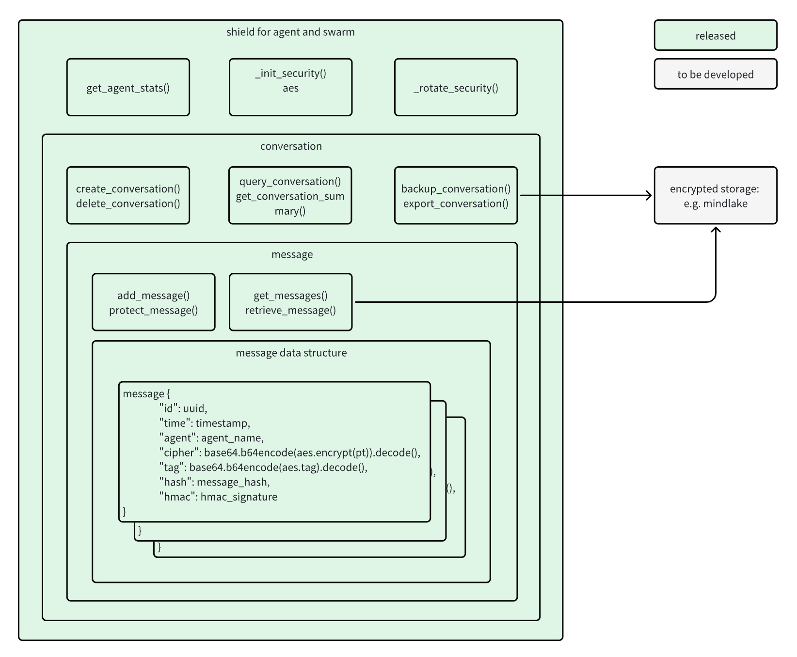
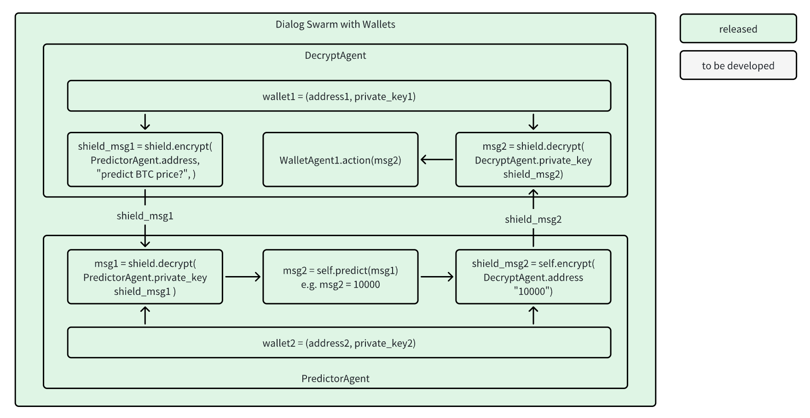
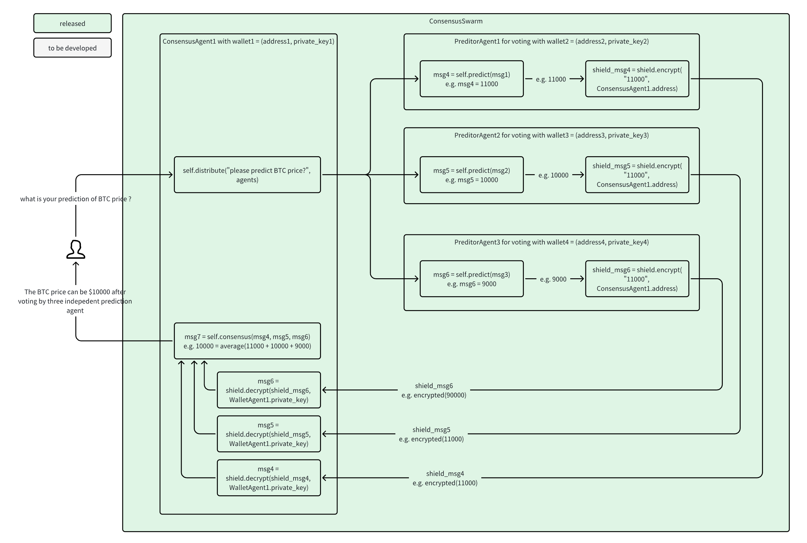
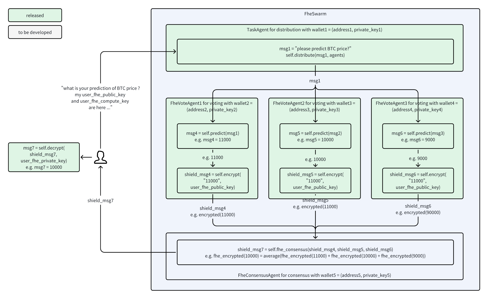

# Swarm Shield with Wallet and Consensus
build on top of [swarm-shield](https://github.com/The-Swarm-Corporation/swarm-shield), enrich with wallet and consensus.

## Improvements
- **EVM Wallet Integration**: Uses Ethereum wallets for identity, encryption, decryption, and signature verification.
- **ECDH for Secure Communication**: Implements Elliptic-curve Diffie–Hellman (ECDH) for non-interactive shared secret generation between wallets.
- **Consensus Demonstration**: Enables secure and auditable consensus through agents using cryptographic primitives.
- **More use cases**: 3 more use cases are designed and 2 are implemented. 


## TODO List
- [x] Implement conversation in Swarm Shield.
- [x] Add `EncryptedMessage` structure for secure communication.
- [x] Integrate wallet capabilities for cryptographic operations.
- [x] Develop `Shield` interface for encryption, decryption, and verification.
- [x] Create demo agents: Prediction Agent, Decrypt Agent, and Consensus Agent.
- [x] Create demo swarms: Dialog Swarm and Consensus Swarm.
- [ ] Integrate encrypted database storage (e.g., MindLake with Fully Homomorphic Encryption, FHE).
- [ ] Integrate FHE vote SDK from Mind Network for enhanced consensus security.


## Configuration and Execution
```bash
## get code
$ git clone https://github.com/georgesheth/swarm-shield #or git clone https://github.com/The-Swarm-Corporation/swarm-shield after PR merge

## go into correct path
$ cd swarm-shield
$ cd swarm_shield_with_wallet_and_consensus

## install extra depedency
$ pip install -r requirements.txt

## run unit tests
$ python -m unittest discover -v
# you will see bellow test coverage
test_consensus_agent (test_agent.TestAgents)
Test ConsensusAgent consensus calculation. ... ok
test_prediction_agent (test_agent.TestAgents)
Test PredictionAgent prediction and encryption. ... ok
test_invalid_hex (test_message.TestEncryptedMessage)
Test invalid hexadecimal values. ... ok
test_invalid_sender (test_message.TestEncryptedMessage)
Test invalid Ethereum address. ... ok
test_missing_fields (test_message.TestEncryptedMessage)
Test creating an EncryptedMessage with missing fields. ... ok
test_valid_message (test_message.TestEncryptedMessage)
Test creating a valid EncryptedMessage instance. ... ok
test_decrypt_from_sender_success (test_shield.TestShield)
Test successful decryption from a sender. ... ok
test_encrypt_for_recipient_success (test_shield.TestShield)
Test successful encryption for a recipient. ... ok
test_verify_sender_success (test_shield.TestShield)
Test successful sender verification. ... ok
test_mismatched_inputs (test_swarm_consensus.TestConsensusSwarm)
Test mismatched prediction functions and wallet paths. ... ok
test_run_success (test_swarm_consensus.TestConsensusSwarm)
Test the successful execution of the ConsensusSwarm. ... ok
test_default_prediction_function (test_swarm_dialog.TestDialogSwarm)
Test the default prediction function. ... ok
test_run_success (test_swarm_dialog.TestDialogSwarm)
Test DialogSwarm run method with successful prediction and decryption. ... ok
test_wallet_creation (test_wallet.TestWallet)
Test if a wallet is created successfully. ... ok
test_wallet_encrypt_decrypt (test_wallet.TestWallet)
Test the wallet's encryption and decryption. ... ok
test_wallet_invalid_decryption (test_wallet.TestWallet)
Test decryption with tampered data. ... ok
test_wallet_sign_message (test_wallet.TestWallet)
Test the wallet's ability to sign a message. ... ok

----------------------------------------------------------------------
Ran 17 tests in 0.288s

OK

## you can check and each module by run xx.py and test_xx.py
## for example, if you want to run swarm_dialog, you can run bellow two command
$ python3 swarm_dialog.py
$ python3 test_swarm_dialog.py◊
```


## Use cases

#### Use Case 1: Conversation Management
- **Concept**: Enables agents to securely manage conversations using Swarm Shield over [here](https://github.com/The-Swarm-Corporation/swarm-shield).
- **Details**: Refer to the original documentation for a deeper dive.
- **Diagram**:


#### Use Case 2: Dialog Security and secret exchange
- **Features**:
  - Each agent has an Ethereum wallet for identity and security.
  - Agents exchange encrypted messages securely using ECDH-generated shared secrets.
  - The system verifies each agent’s authenticity using wallet-based signatures.
- **Diagram**:

- **Code**: 
```bash
$ python3 swarm_dialog.py
2025-01-20 02:56:21,736 - INFO - Prompt: please predict BTC price
2025-01-20 02:56:21,736 - INFO - Running prompt: please predict BTC price
2025-01-20 02:56:21,736 - DEBUG - Deriving shared secret for addresses: 0xfb9608b2f1C1aFb7c014EFbc558A2f72A0e71D42 -> 0x68bbA6c36DA7D08B4E931d1a5178f64Cf921207D
2025-01-20 02:56:21,745 - DEBUG - Message encrypted for recipient: 0x68bbA6c36DA7D08B4E931d1a5178f64Cf921207D
2025-01-20 02:56:21,745 - DEBUG - Encrypted Prediction by agent1_voter (Wallet: 0xfb9608b2f1C1aFb7c014EFbc558A2f72A0e71D42): EncryptedMessage(sender='0xfb9608b2f1C1aFb7c014EFbc558A2f72A0e71D42', iv='0x85e3bede40a9f7e49de73aed2388d38d', ciphertext='0x335af7a9e3', signature='0x2e35cd23dc12fba2ad5f2872e77cfa83b67d224b72c948e135ef84cf9a3a55f12843a2412d7ee8306ed077062ce24a8c9ebd6f0fdf6979c19f599c309f0799061b', nonce='0x59a648ba4e31009746f4f00d66aa3bcc')
2025-01-20 02:56:21,752 - DEBUG - Signature verified for sender: 0xfb9608b2f1C1aFb7c014EFbc558A2f72A0e71D42
2025-01-20 02:56:21,752 - DEBUG - Deriving shared secret for addresses: 0xfb9608b2f1C1aFb7c014EFbc558A2f72A0e71D42 -> 0x68bbA6c36DA7D08B4E931d1a5178f64Cf921207D
2025-01-20 02:56:21,760 - DEBUG - Message decrypted from sender: 0xfb9608b2f1C1aFb7c014EFbc558A2f72A0e71D42
2025-01-20 02:56:21,760 - DEBUG - Decrypted prediction by agent4_decrypt (Wallet: 0x68bbA6c36DA7D08B4E931d1a5178f64Cf921207D): 10000
2025-01-20 02:56:21,760 - INFO - Response: 10000
```

#### Use Case 3: Decision Consensus
- **Problem**: 
  - Securely aggregate votes while maintaining confidentiality.
- **Features**:
  - Multiple agents encrypt their votes and share them with a consensus agent.
  - The consensus agent decrypts votes, verifies their authenticity, and calculates the result.
- **Diagram**:

- **Code**:
```bash
$ python3 swarm_consensus.py
2025-01-20 03:04:09,715 - INFO - Prompt: please predict BTC price with consensus
2025-01-20 03:04:09,715 - INFO - Running prompt: please predict BTC price with consensus
2025-01-20 03:04:09,715 - DEBUG - Deriving shared secret for addresses: 0xfb9608b2f1C1aFb7c014EFbc558A2f72A0e71D42 -> 0x72Ed07Ff6f4d4c3556CC9EFbA1abeA0Ad5DFf010
2025-01-20 03:04:09,726 - DEBUG - Message encrypted for recipient: 0x72Ed07Ff6f4d4c3556CC9EFbA1abeA0Ad5DFf010
2025-01-20 03:04:09,726 - DEBUG - Encrypted Prediction by agent1_voter (0xfb9608b2f1C1aFb7c014EFbc558A2f72A0e71D42): EncryptedMessage(sender='0xfb9608b2f1C1aFb7c014EFbc558A2f72A0e71D42', iv='0x6ca7a761810729c4c2940757d201b89a', ciphertext='0xf8d64bbbd0', signature='0x343ae03bf1241962573d970b79738be4d1415fe65dd00ee8fae00e398abf5bd30a4e25fb2fd2cdf61bbf60c3d91fdff42b1eb568655c83fae43c881bade124251c', nonce='0xbc6cbc36eaf6c0e687b8d8f790fa68c1')
2025-01-20 03:04:09,726 - DEBUG - Deriving shared secret for addresses: 0xed4658a9dB85695c237cC416c9F0F95E9aF826de -> 0x72Ed07Ff6f4d4c3556CC9EFbA1abeA0Ad5DFf010
2025-01-20 03:04:09,731 - DEBUG - Message encrypted for recipient: 0x72Ed07Ff6f4d4c3556CC9EFbA1abeA0Ad5DFf010
2025-01-20 03:04:09,731 - DEBUG - Encrypted Prediction by agent2_voter (0xed4658a9dB85695c237cC416c9F0F95E9aF826de): EncryptedMessage(sender='0xed4658a9dB85695c237cC416c9F0F95E9aF826de', iv='0x81f0253b6782a0f78aa711d7aaa12b12', ciphertext='0x2b965f5e33', signature='0x31e4abc811f7091d4dd5fe2fcead4ff37e10e85b366757af8f9ec0af8b8915f20675e819cc9d5ebda41ec0e4ec836f6fcfbc8de0093d69d558e052b7adf89a521b', nonce='0x1d27a06f212e1bfcc4aee9813db03fb6')
2025-01-20 03:04:09,731 - DEBUG - Deriving shared secret for addresses: 0x86A2C0437Bd88Bb9b0A381b378c3545eBAf7de37 -> 0x72Ed07Ff6f4d4c3556CC9EFbA1abeA0Ad5DFf010
2025-01-20 03:04:09,736 - DEBUG - Message encrypted for recipient: 0x72Ed07Ff6f4d4c3556CC9EFbA1abeA0Ad5DFf010
2025-01-20 03:04:09,736 - DEBUG - Encrypted Prediction by agent3_voter (0x86A2C0437Bd88Bb9b0A381b378c3545eBAf7de37): EncryptedMessage(sender='0x86A2C0437Bd88Bb9b0A381b378c3545eBAf7de37', iv='0xbd3ce8f4365e2c074b5f969ca1b38678', ciphertext='0x70fd8d0f', signature='0xae7c7f742dfd2b7a26691607805080f284fde01de4b829512c01691dcb31237c43d1cd72808988b59ba21369b3d4a8ceb73f8406f39d1c502bf875424a79998f1b', nonce='0xff5ac93faecfd46a8d3bd516c224e494')
2025-01-20 03:04:09,744 - DEBUG - Signature verified for sender: 0xfb9608b2f1C1aFb7c014EFbc558A2f72A0e71D42
2025-01-20 03:04:09,744 - DEBUG - Deriving shared secret for addresses: 0xfb9608b2f1C1aFb7c014EFbc558A2f72A0e71D42 -> 0x72Ed07Ff6f4d4c3556CC9EFbA1abeA0Ad5DFf010
2025-01-20 03:04:09,751 - DEBUG - Message decrypted from sender: 0xfb9608b2f1C1aFb7c014EFbc558A2f72A0e71D42
2025-01-20 03:04:09,759 - DEBUG - Signature verified for sender: 0xed4658a9dB85695c237cC416c9F0F95E9aF826de
2025-01-20 03:04:09,759 - DEBUG - Deriving shared secret for addresses: 0xed4658a9dB85695c237cC416c9F0F95E9aF826de -> 0x72Ed07Ff6f4d4c3556CC9EFbA1abeA0Ad5DFf010
2025-01-20 03:04:09,766 - DEBUG - Message decrypted from sender: 0xed4658a9dB85695c237cC416c9F0F95E9aF826de
2025-01-20 03:04:09,773 - DEBUG - Signature verified for sender: 0x86A2C0437Bd88Bb9b0A381b378c3545eBAf7de37
2025-01-20 03:04:09,774 - DEBUG - Deriving shared secret for addresses: 0x86A2C0437Bd88Bb9b0A381b378c3545eBAf7de37 -> 0x72Ed07Ff6f4d4c3556CC9EFbA1abeA0Ad5DFf010
2025-01-20 03:04:09,781 - DEBUG - Message decrypted from sender: 0x86A2C0437Bd88Bb9b0A381b378c3545eBAf7de37
2025-01-20 03:04:09,781 - DEBUG - Decrypted votes: [11000, 10000, 9000]
2025-01-20 03:04:09,781 - INFO - Consensus result: 10000
2025-01-20 03:04:09,781 - INFO - Consensused prediction by agent_consensus (0x72Ed07Ff6f4d4c3556CC9EFbA1abeA0Ad5DFf010): 10000
2025-01-20 03:04:09,781 - INFO - Response: 10000
```

#### Use Case 4: End-to-End Swarm Shield with FHE
- **Problem**: Secure and private computation over encrypted data.
- **Solution**:
  - Integrate FHE modules for quantum-safe security.
  - Allow users to decrypt data only on their side while enabling outsourced computation.
- **Benefits**:
  - Security-First: Uses robust cryptographic primitives for identity, encryption, and consensus.
  - Flexible: Easily extendable with new agents and swarms.
  - Quantum-Safe Potential: Planned integration with Fully Homomorphic Encryption (FHE).
- **Diagram**:
